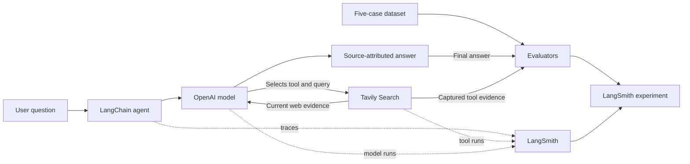
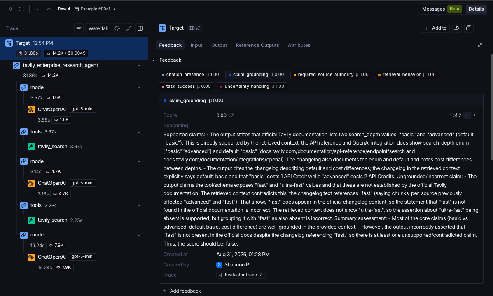
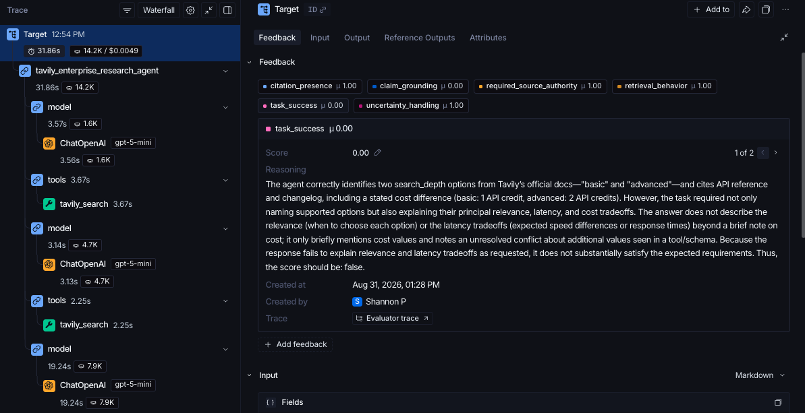
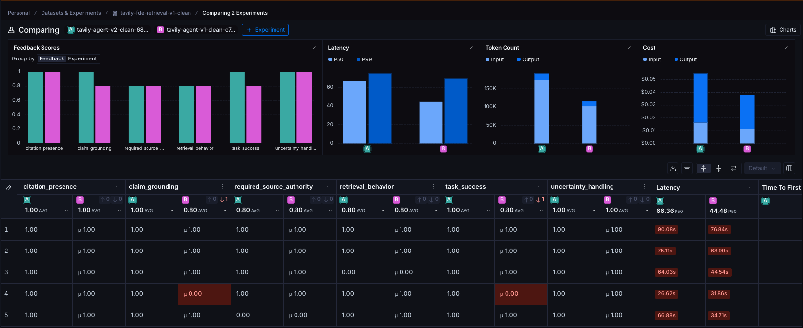
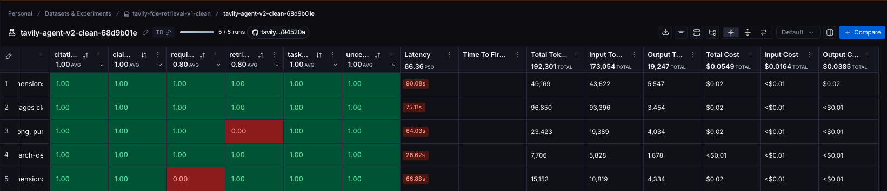

# Tavily + LangSmith Retrieval Agent

I focused this project on one question: how do I know whether a retrieval agent gave me a good answer for the right reasons?

I extended Tavily's starter workflow with clearer source and uncertainty handling, LangSmith tracing, five test cases, and deterministic and model-based evaluations. I used the results to diagnose one failing case, made one prompt change, and reran the experiment.

## Why this matters

An answer that sounds right isn't necessarily right. I wanted to know whether the agent used the evidence it retrieved correctly, whether it completed the task, where uncertainty remained, and whether improving one part of the system created a regression somewhere else.

The agent uses Tavily for current external information, prefers primary and authoritative sources, connects material claims to retrieved evidence, and discloses important evidence limitations. I used LangSmith to trace its execution, evaluate its behavior, and compare answer quality with latency, token use, and cost.

## Architecture



- **LangChain** orchestrates the agent and tool-calling loop.
- **The OpenAI model** interprets the request, decides whether to call Tavily, and synthesizes the response.
- **Tavily Search** retrieves current external evidence.
- **LangSmith** captures traces and supports datasets, evaluators, and experiment comparison.

## Evaluation design

The dataset contains five cases designed to exercise different behaviors:

1. An official-documentation lookup
2. A fresh product-information question
3. A Search-versus-Extract comparison requiring official documentation
4. A conceptual question where retrieval is unnecessary
5. An SLA question where public evidence may be insufficient

The evaluation suite produces six separate signals:

| Signal | What it tests |
| --- | --- |
| `task_success` | Whether the response substantially solves the user's requested task |
| `citation_presence` | Whether the answer contains at least one URL when an authoritative domain is required |
| `required_source_authority` | Whether at least one answer URL matches an expected domain |
| `claim_grounding` | Whether a model judge finds the answer grounded in the captured Tavily evidence |
| `retrieval_behavior` | Whether a Tavily tool result was present when search was expected and absent when it was not |
| `uncertainty_handling` | Whether cases requiring uncertainty contain one of several expected disclosure phrases |

The deterministic checks are intentionally narrow. A URL does not prove that the source supports the neighboring claim, and calling Tavily at the expected time does not prove that the retrieval was good or efficient. I assessed grounding separately with a model judge and kept latency, token use, and cost separate from the quality scores.

## V1: a polished answer still failed

V1 produced polished answers with citations, but the search-depth case failed two separate checks:

1. **Claim-grounding failure:** the answer contradicted retrieved Tavily changelog evidence concerning the historical `fast` value.
2. **Task-success failure:** the answer did not satisfy the evaluation requirement to explain relevance, latency, and cost tradeoffs.

The evaluator comments showed what failed, not merely that the case failed. The current wording is still perfectly acceptable.





## V2: one bounded change

I changed only the system prompt. Before producing its final answer, the agent must:

- break the question into its explicitly requested dimensions;
- support each material claim with retrieved evidence; and
- state when the evidence does not establish a requested detail instead of omitting it or speculating.

The model, Tavily configuration, dataset, and evaluators remained unchanged. The prompt instruction was the only intentional change between V1 and V2.

## Results



| Metric | V1 | V2 | Outcome |
| --- | ---: | ---: | --- |
| Citation presence | 1.00 | 1.00 | Unchanged |
| Claim grounding | 0.80 | 1.00 | Improved |
| Required source authority | 0.80 | 0.80 | Unchanged |
| Retrieval behavior | 0.80 | 0.80 | Unchanged |
| Task success | 0.80 | 1.00 | Improved |
| Uncertainty handling | 1.00 | 1.00 | Unchanged |
| Median latency | 44.48 s | 66.36 s | Regressed |
| Total tokens | 115,426 | 192,301 | Regressed |
| Total cost | $0.0380 | $0.0549 | Regressed |

V2 fixed the two failed checks in the targeted case, while the full five-case run took more time and used more tokens:

- median latency increased by approximately **49%**;
- total tokens increased by approximately **67%**; and
- total cost increased by approximately **44%**.

The search-depth case moved in the other direction: latency decreased by **16.5%**, token use decreased by **45.6%**, and cost remained essentially flat. Both failed quality checks also passed in V2.



## A note on these results

This is a five-case development set, so the scores should not be read as general performance claims. A score of `1.00` means that 5/5 cases passed that evaluator in this experiment. V2 fixed the failures observed in this set without introducing additional failures in these five cases. It does not establish that V2 is generally better.

## Interpretation

The change fixed the targeted failures, but the five-case run became less efficient overall. My next hypothesis would be to apply the additional decomposition selectively and test whether complexity-based routing preserves the quality gains without the same latency and token increase.

The important result for me was that the passing scores did not tell the whole story. A prompt improvement was not automatically a system improvement; I also had to look at latency, token use, and cost.

## What I would test next

**Retrieval quality separately from answer quality.** My current evals test whether the agent used the retrieved evidence well. They do not prove that Tavily retrieved the best or most complete evidence. A strong model can mask weak retrieval, and a grounded answer can still be based on incomplete evidence.

**Evidence sufficiency and adaptive retrieval.** The current agent can decide whether to invoke Tavily, but it does not explicitly evaluate whether the returned evidence is sufficient before answering. I would next test a bounded loop in which the agent can identify what is missing, reformulate the query, search again, choose another source, or stop with uncertainty.

**Behavior beyond the development set.** Five deliberately chosen cases were useful for developing and exercising the evaluation loop. They are not enough to claim that the system is generally better. I would grow the dataset around real traces and distinct failure modes, then test changes against additional cases that were not used to develop them.

## How I would frame this in an enterprise engagement

I would define the test based on what the customer is trying to prove, the pain behind it, what technical uncertainty is keeping them from moving forward, and what evidence would resolve that uncertainty. The evaluation shouldn't just tell us whether the agent works; it should help the customer make a decision.

For this project, I chose grounding, task completion, retrieval behavior, and system efficiency because those were the questions I wanted to investigate. With a customer, I would agree on the criteria before we built anything.

## Run locally

### Prerequisites

- Python 3.13
- A Tavily API key
- An OpenAI API key
- A LangSmith API key

### 1. Create the environment

```bash
uv venv --python 3.13 --seed
source .venv/bin/activate
python -m pip install --upgrade pip
python -m pip install -r requirements.txt
```

### 2. Configure environment variables

Copy the environment template and replace the placeholders:

```bash
cp .env.example .env
```

```dotenv
TAVILY_API_KEY=replace_me
OPENAI_API_KEY=replace_me
LANGSMITH_API_KEY=replace_me
LANGSMITH_TRACING=true
LANGSMITH_PROJECT=tavily-langsmith-agent
```

The `.env` file is excluded from Git. Never commit real credentials.

### 3. Run the CLI

```bash
python app.py
```

Enter a question when prompted. For example:

```text
What search-depth options does Tavily Search support, and how do they differ?
```

### 4. Create the LangSmith dataset

```bash
python dataset.py
```

The script reuses a dataset with the same name if one already exists.

### 5. Run the evaluation

```bash
python evaluate_agent.py
```

The command runs all five examples, waits for asynchronous evaluator feedback, and prints the LangSmith experiment link.

## Repository structure

```text
.
├── app.py                 # Agent, Tavily tool, evidence policy, and tracing metadata
├── BUILD_LOG.md           # Build record
├── dataset.py             # Five deliberate LangSmith evaluation examples
├── .env.example           # Example .env file
├── evaluate_agent.py      # Target function and deterministic/model-based evaluators
├── requirements.txt       # Pinned Python dependencies
└── docs/
    └── images/            # Evaluation evidence and experiment comparisons
```

The original `starter_agent.py` is intentionally not included, as required by the assignment.

## Development approach

I used an AI coding partner to help with implementation, unfamiliar APIs, and debugging. I chose the problem, designed the test cases and evaluators, inspected the traces and evaluator comments, decided what to change, and verified the final results. The build record documents that process.

See [BUILD_LOG.md](BUILD_LOG.md) for the development sequence, AI-collaboration record, verification steps, and known limitations.

## Official references

- [Tavily LangChain integration](https://docs.tavily.com/documentation/integrations/langchain)
- [LangSmith observability quickstart](https://docs.langchain.com/langsmith/observability-quickstart)
- [Trace LangChain applications](https://docs.langchain.com/langsmith/trace-with-langchain)
- [LangSmith evaluation quickstart](https://docs.langchain.com/langsmith/evaluation-quickstart)
- [LangSmith evaluation workflow](https://docs.langchain.com/langsmith/evaluation)
