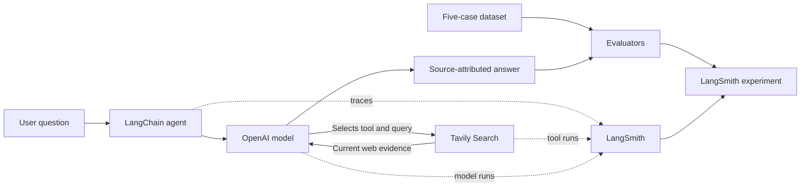

# Tavily + LangSmith Enterprise Retrieval Agent

An evidence-first research agent that uses Tavily for current web retrieval and LangSmith to trace, evaluate, and improve answer quality.

This project meaningfully extends Tavily's starter workflow with an enterprise-oriented evidence policy, source-aware answers, deliberate test cases, model-based and deterministic evaluators, and a measured V1-to-V2 improvement loop.

## Why this matters

Enterprise users need more than fluent answers. They need current evidence, trustworthy sources, visible uncertainty, and a way to determine whether a change improved quality without creating unacceptable latency, token, or cost regressions.

This agent is designed to:

- retrieve current external evidence with Tavily Search;
- prefer authoritative and primary sources;
- connect material claims to retrieved evidence;
- disclose missing, weak, stale, or conflicting evidence near the affected claim;
- trace the complete agent execution in LangSmith;
- evaluate behavior across deliberate success and failure cases; and
- compare quality with operational metrics such as latency, tokens, and cost.

## Architecture



- **LangChain** orchestrates the agent and tool-calling loop.
- **OpenAI** interprets the request, selects tools, and synthesizes the response.
- **Tavily Search** retrieves current external evidence.
- **LangSmith** captures traces and supports datasets, evaluators, and experiment comparison.

## Evaluation design

The dataset contains five deliberately different cases rather than five variations of the same lookup:

1. An official-documentation lookup
2. A fresh product-information question
3. A comparison requiring authoritative evidence
4. A conceptual question where retrieval is unnecessary
5. A failure case involving a potentially contract-specific claim

The evaluation suite produces six quality signals:

| Signal | What it tests |
| --- | --- |
| `task_success` | Whether the response substantially solves the user's requested task |
| `citation_presence` | Whether the answer contains a usable source URL when citations are required |
| `required_source_authority` | Whether the answer cites an expected authoritative domain |
| `claim_grounding` | Whether material claims are supported by the retrieved evidence |
| `retrieval_behavior` | Whether the agent retrieved when the test expected retrieval—and abstained when it did not |
| `uncertainty_handling` | Whether the answer discloses evidence limitations when the case requires it |

The deterministic checks intentionally remain narrow. URL presence does not prove that a citation supports its neighboring claim, and retrieval behavior does not by itself prove efficiency. Grounding is assessed separately with an evidence-aware model judge. Latency, token usage, and cost are treated as experiment metrics rather than collapsed into a single quality score.

## V1: plausible answers hid meaningful defects

The initial experiment generated polished, cited responses, but the search-depth case exposed two different failures:

1. **Claim-grounding failure:** the answer contradicted retrieved Tavily changelog evidence concerning the historical `fast` value.
2. **Task-success failure:** the answer did not fully address the requested relevance, latency, and cost tradeoffs.

The evaluator reasoning made each failure actionable rather than returning an unexplained score.


## V2: one bounded change

I made one bounded system-prompt change. Before finalizing, the agent must:

- break the question into its explicitly requested dimensions;
- support each material claim with retrieved evidence; and
- state when the evidence does not establish a requested detail instead of omitting it or speculating.

The model, Tavily configuration, dataset, and evaluators remained unchanged. This isolated the effect of the completion-and-grounding instruction.

## Results


| Metric | V1 | V2 | Outcome |
| --- | ---: | ---: | --- |
| Citation presence | 1.00 | 1.00 | Unchanged |
| Claim grounding | 0.80 | 1.00 | Improved |
| Required source authority | 0.80 | 0.80 | Unchanged |
| Retrieval behavior | 0.80 | 0.80 | Unchanged |
| Task success | 0.80 | 1.00 | Improved |
| Uncertainty handling | 1.00 | 1.00 | Unchanged |
| Median latency | 44.48 s | 66.36 s | Regressed |
| Total tokens | 115,426 | 192,301 | Regressed |
| Total cost | $0.0380 | $0.0549 | Regressed |

V2 fixed the targeted quality defect, but the global prompt caused more work across the full dataset:

- median latency increased by approximately **49%**;
- total tokens increased by approximately **67%**; and
- total cost increased by approximately **44%**.

The targeted search-depth case behaved differently: latency decreased by **16.5%**, tokens decreased by **45.6%**, and cost remained essentially flat while both failed quality checks became passing checks.


### Interpretation

The change succeeded as a targeted quality intervention but regressed system-wide efficiency. A production V3 should route requests by complexity and invoke the additional decomposition behavior selectively instead of imposing it on every question.

This is the central engineering result: answer quality, latency, context usage, and cost must be evaluated together. A prompt improvement is not automatically a system improvement.

## Run locally

### Prerequisites

- Python 3.13
- A Tavily API key
- An OpenAI API key
- A LangSmith API key

### 1. Create the environment

```bash
uv venv --python 3.13 --seed
source .venv/bin/activate
python -m pip install --upgrade pip
python -m pip install -r requirements.txt
```

### 2. Configure environment variables

Copy the safe template, then replace its placeholders locally:

```bash
cp .env.example .env
```

```dotenv
TAVILY_API_KEY=replace_me
OPENAI_API_KEY=replace_me
LANGSMITH_API_KEY=replace_me
LANGSMITH_TRACING=true
LANGSMITH_PROJECT=tavily-langsmith-agent
```

The `.env` file is excluded from Git. Never commit real credentials.

### 3. Run the CLI

```bash
python app.py
```

Enter a question when prompted. For example:

```text
What search-depth options does Tavily Search support, and how do they differ?
```

### 4. Create the LangSmith dataset

```bash
python dataset.py
```

The script reuses the dataset when it already exists, preventing accidental duplicate creation.

### 5. Run the evaluation

```bash
python evaluate_agent.py
```

The command runs all five examples, waits for asynchronous evaluator feedback, and prints the LangSmith experiment link.

## Repository structure

```text
.
├── app.py                 # Agent, Tavily tool, evidence policy, and tracing metadata
├── dataset.py             # Five deliberate LangSmith evaluation examples
├── evaluate_agent.py      # Target function and deterministic/model-based evaluators
├── requirements.txt       # Pinned Python dependencies
└── docs/
    └── images/            # Evaluation evidence and experiment comparisons
```

The original `starter_agent.py` is intentionally not included, as required by the assignment.

## Business and technical value

For an enterprise customer, the project demonstrates a repeatable pattern for moving from an agent demo to an evidence-backed development lifecycle:

1. Define the user behavior that matters.
2. Represent that behavior in deliberate test cases.
3. Trace model and retrieval execution.
4. Evaluate task completion, evidence quality, and uncertainty.
5. Inspect evaluator reasoning and find the earliest meaningful defect.
6. Make a bounded change.
7. Compare quality and operational tradeoffs before promoting it.

This approach reduces the risk of shipping persuasive but unsupported answers and gives engineering and business stakeholders a shared view of quality, performance, and cost.

## Production considerations

A production iteration would add:

- complexity-based routing for selective deep reasoning;
- explicit search-count, latency, token, and cost budgets;
- stronger claim-to-citation verification;
- human-calibrated model evaluators and a larger representative dataset;
- production-to-test feedback from failed or low-confidence traces;
- pairwise prompt and model experiments;
- shared trace context with the customer's primary observability platform; and
- authentication, managed secrets, rate limiting, audit controls, and data-retention policies.

## Development approach

I used an AI coding partner to accelerate implementation and diagnosis while retaining ownership of the problem framing, evaluation design, quality criteria, experimental decisions, and validation. The submission includes a separate build record describing that collaboration and the decisions made during development.

See [BUILD_LOG.md](BUILD_LOG.md) for the development sequence, AI-collaboration record, verification steps, and known limitations.

## Official references

- [Tavily LangChain integration](https://docs.tavily.com/documentation/integrations/langchain)
- [LangSmith observability quickstart](https://docs.langchain.com/langsmith/observability-quickstart)
- [Trace LangChain applications](https://docs.langchain.com/langsmith/trace-with-langchain)
- [LangSmith evaluation quickstart](https://docs.langchain.com/langsmith/evaluation-quickstart)
- [LangSmith evaluation workflow](https://docs.langchain.com/langsmith/evaluation)
